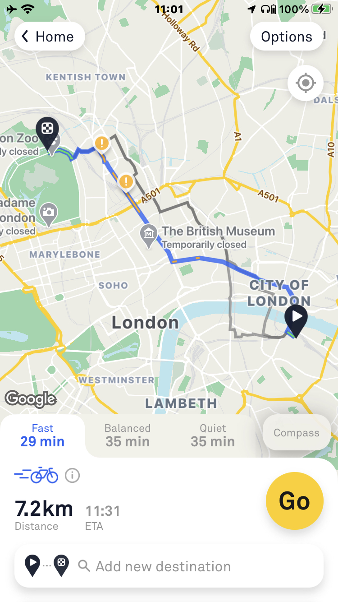
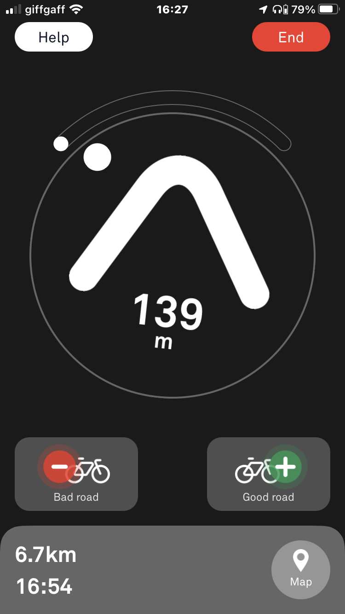

# Beeline Android SDK

Integrate Beeline routing and navigation into your Android app

## Requirements

- Supports **Android 21 (5.0 Lollipop)** and above
- Supports **armeabi-v7a**, **arm64-v8a**, **x86**, **x86_64**

- Written in **Kotlin** and **C++**
- Depends on **RxJava2**

Note: This guide has been written assuming the reader has a good understanding of RxJava2.

## Installation

Contact us for credentials tech@beeline.co


### Add Beeline SDK dependency

Register the Beeline maven repository in your project level `build.gradle` file:

```gradle
allprojects {

  repositories {

    // other repositories omitted

    maven {
      name = "GitHubPackages"
      url = uri("https://maven.pkg.github.com/RideBeeline/packages")
      credentials {
        username = 'username'
        password = 'password'
      }
    }
  }

}
```

In your module level `build.gradle` file:

```gradle
dependencies {
  implementation 'co.beeline:beeline-sdk:2.0.0'
}
```

## Integration

### Specify permissions

The Beeline SDK requires the `INTERNET` and `ACCESS_FINE_LOCATION` permissions.

In your `AndroidManifest.xml`

```xml
<!-- Under manifest tag -->
<uses-permission android:name="android.permission.INTERNET" />
<uses-permission android:name="android.permission.ACCESS_FINE_LOCATION" />
```

We leave it to you to ensure you request the appropriate location permissions from your users.

See https://developer.android.com/training/permissions/requesting


## Routing

### Request routes

The Beeline routing API will return up to three routes. Each route is categorised as follows:
- **Fast**

 *Prioritises the shortest, simplest route. May contain fast traffic and tricky junctions.*
- **Balanced**

 *Fairly direct, using well-rated roads and paths where possible.*
- **Quiet**

 *Keeps you on well-rated roads from the Beeline community. It may feel longer, but you'll ride great roads.*

Please note that in some cases, especially for shorter routes, routes can be close to identical. In this case less than three will be returned. They will be prioritised in this order:
- balanced
- fast
- quiet

Examle from the Beeline app displaying three different route options



### Example request

Request bicycle routes between two coordinates.

Note, the `instance` and `key` parameters will be provided to you by Beeline.

```kotlin
val routeProvider: RouteProvider = BeelineRouting(instance, key)

val parameters = RouteParameters(
  vehicle = Vehicle.Bicycle,
  start = Coordinate(51.50804, -0.12807),
  end = Coordinate(51.504500, -0.086500)
)

val disposable = routeProvider.route(parameters)
    .subscribeOn(Schedulers.io())
    .observeOn(AndroidSchedulers.mainThread())
    .subscribe(
        { routes ->
            // Handle success
        },
        { error ->
            // Handle error
        }
    )

// Remember to handle your Rx disposables
```

### Example response

```Kotlin
val route routes.first() // Up to 3 returned
route.estimatedDistance // distance in meters
route.estimatedDuration // duration in milliseconds
route.meteData.category // Fast, Quiet, Balanced or Default
val course = route.course // The underlying route used for navigation
route.roadRatings.forEach { roadRating ->
  roadRating.isPositive // If this is a postively or negatively rated road
  roadRating.polyline // Decode to display on a map
}
```

### Displaying a route on a map

Each route provides a `polyline` of encoded coordinates. You can decode this polyline to display the route on a map. We currently do not provide specific tools for mapping providers.

If you are new to polylines, this [tool](https://developers.google.com/maps/documentation/utilities/polylineutility) may be helpful.

```kotlin
val polyline = routes.first().polyline
print(polyline) // "yqstHl_mJOU_@_Au@}B"
```

### Displaying Beeline Road Ratings

Each route also contains road ratings describing sections of the route that Beeline Routing considers to be positive or negative.

```kotlin
route.roadRatings.forEach { roadRating ->
  roadRating.isPositive // If this is a postively or negatively rated road
  roadRating.polyline // Decode to display on a map
}
```

### Passing routes between Android components

Beeline model classes implement the `Parcelable` interface, allowing you to include them in an `Intent`.

```kotlin
  val route = routeResponse.route

  val intent = Intent(this, NavigationActivity::class.java).apply {
      putExtra(NavigationActivity.EXTRA_ROUTE, route)
  }

  startActivity(intent)

  // ...

  // Get the route from the intent
  val route = intent.getParcelableExtra<TrackRoute>(EXTRA_ROUTE)!!
}
```

## Navigation

Example of navigation screen from the Beeline app

 

### Navigator

Navigation is handled by instances of `Navigator`. It handles all the route logic and by default will attempt to automatically reroute if the user deviates from the route.

The `Navigator` produces a `RideSnapshot` for each location update (usually once a second).

The snapshot provides information including:
- bearing to next junction
- anticipation bearing
- distance to next junction
- distance to destination
- time to destination
- next maneuver
- if the user is on or off route

```kotlin
// Subscribe to navigation updates
navigator.snapshotObservable
  .subscribe { snapshot ->

  }
```

### Maneuvers

Beeline currently provides the following maneuver indicators:


- Fork/turn left
- Fork/turn right
- Keep left
- Keep right
- Roundabout

### Navigation events

The `Navigator` also produces `NavigationEvent`s when the following events occur:
- Reroute started
- Reroute succeeded
- Reroute failed

You can use these if you want to display notifications for example when the route is updated or the reroute failed.

```kotlin
// Subscribe to navigation events
navigator.events
  .subscribe { event ->

  }
```

### Creating a navigator

The `Navigator` needs various dependencies so we recommend you instantiate it via a `BeelineNavigatorFactory`.

In theory a `Navigator` does not have the same lifecycle as an `Activity` so you may want to hold a reference to your `Navigator` in a `Service`. For example if you wanted to allow your navigator to continue to run if the app is in the background.

For a simple example you could inject an instance of `BeelineNavigatorFactory` into an Activity then create an instance from a route you passed via an `Intent`.

```kotlin
@Inject
val navigatorFactory: BeelineNavigatorFactory

...
// Inject ...
val route = intent.getParcelableExtra<TrackRoute>(EXTRA_ROUTE)!!
val navigator = factory.navigator(route)
```

You can create your own factory implementation or use the one we provide based on your needs.

For example
```kotlin
val routeProvider: RouteProvider = BeelineRouting(instance, key)
val locationProvider = SimpleLocationProvider(context) // Or use your own

val navigatorFactory: BeelineNavigatorFactory = DefaultBeelineNavigatorFactory(
  routeProvider = routeProvider,
  locationProvider = locationProvider
)
```

### Displaying Beeline navigation

The Beeline SDK uses the ViewModel pattern, building on Android JetPack's ViewModel library.
Learn more [here](https://developer.android.com/topic/libraries/architecture/viewmodel).

We also use Android JetPack ViewBinding.
Learn more [here](https://developer.android.com/topic/libraries/view-binding).

Every Android application architecture is different. As a result we do not provide an Activity or Fragment but instead provide components that allow you to integrate them into your app. We also make no assumptions about your architecture with regards to dependency injection and leave this to you to implement. Our ViewModels accept interfaces so you can provide alternatives to our default classes if you desire.

We provide a `NavigationCompassViewHolder` class that binds your layout to a `NavigationViewModel`. This will update the arrow and other components each second.

The main compass interface is `navigation.xml`
This contains the compass arrow, progress indicator, distance to next maneuver, junction indicator, etc.

For a complete layout example please look at `demo_navigation.xml`. However we suggest you make your own.

### NavigationViewModel

As the `NavigationViewModel` has various dependencies we recommend instantiating it via a `Factory` which you inject into your Activity or Fragment.

```kotlin
// In your Dependency injection componet
val factory: BeelineViewModelFactory = DefaultBeelineViewModelFactory(
  context: context, // Application Context
  locationProvider: locationProvider, // created earlier
  distanceFormatter: SimpleDistanceFormatter(context, DistanceUnit.METRIC), // or create your own
  timeFormatter: SimpleTimeFormatter(context) // or create your own
)

// In your Activity, Fragement, etc

@Inject
val viewModelFactory: BeelineViewModelFactory
```

### Example integration
```kotlin

@Inject
val viewModelFactory: BeelineViewModelFactory

@Inject
val navigatorFactory: BeelineNavigatorFactory

...

// ...inject your dependencies

val binding = YourLayoutBinding.inflate(layoutInflater)
// ... set your view

// Get a reference to the `NavigationCompassBinding` generated by the `ViewBinding` library
// The name will be equal to the id you assigned it in your .xml
val beelineNavigationBinding: NavigationCompassBinding
   = yourRootBinding.beelineNavigationCompass

// get the route from the intent
val route = intent.getParcelableExtra<TrackRoute>(EXTRA_ROUTE)!!

// create a navigator for the route
val navigator = navigatorFactory.navigator(route)

// create a view model for the navigator
val navigationViewModel = viewModelFactory.navigationViewModel(navigator)

// Create a viewHolder to bind the ViewModel to the view
val viewHolder = NavigationViewHolder(beelineNavigationBinding, navigationViewModel)

// Start the navigator
navigator.start()

// Start the viewHolder
viewHolder.start()

...

// Stop the viewHolder
viewHolder.stop()

// Stop the navigator
navigator.stop()
```

### Running in the background

If your app is moved to the background, location updates will stop unless you have a foreground `Service` running with the `android:foregroundServiceType="location"` attribute. For the best experience we recommend enabling location updates whilst the app is in the background, but this is not mandatory.

For more information see the Android documentation on accessing location in the background [here](https://developer.android.com/training/location/background#continue-user-initiated-action).
